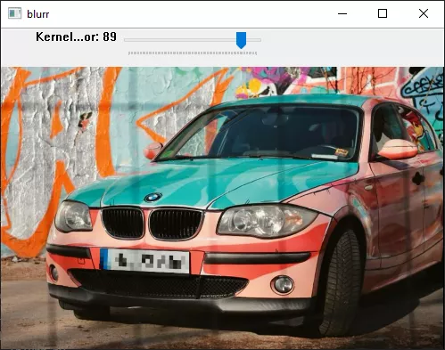

# Blurr

Blurr is a super simple image editing tool written in python.

It can do one thing and one thing only:
Blur selected parts of the image.

*this script was almost entirely written with ChatGPT :D

## Features

- **Blurr or Pixelate:** Define trapezoidal regions by clicking four points to apply a blur or pixelation effect.
- **Mouse-Centered Zoom:** Use the scroll wheel to zoom in/out, with the mouse pointer as the center.
- **Panning:** Drag the image to move around.
- **Toggle Effects:** Switch between Gaussian blur and pixelate modes.
- **File Dialogs:** Open and save images using Tkinter dialogs.

## Screenshots

  
*Defining a region for an effect (blur/pixelate).*

## Dependencies

- [Python 3.x](https://www.python.org/)
- [OpenCV-Python](https://pypi.org/project/opencv-python/)
- [NumPy](https://pypi.org/project/numpy/)
- Tkinter (usually included with Python)

Install the Python packages with:

    pip install opencv-python numpy

## Usage

1. **Clone the repository:**

       git clone https://github.com/GrafKnusprig/blurr
       cd blurr

2. **Run the script:**

       python blurr.py

## Controls

- **o**: Open an image via a file dialog.
- **a**: Enter "adding mode" to define a new effect field (left-click 4 points). When in adding mode, left-click without dragging will add points.
- **r**: Reset all defined effect fields.
- **s**: Save the final image via a save file dialog.
- **q**: Quit the application.
- **Scroll Wheel**: Zoom in/out, centered on the mouse pointer.
- **Left-Drag**: Pan the image when not in adding mode.
- **b**: Toggle between blur and pixelate effect modes.
